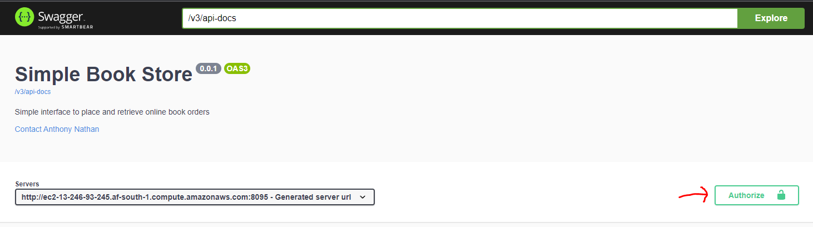
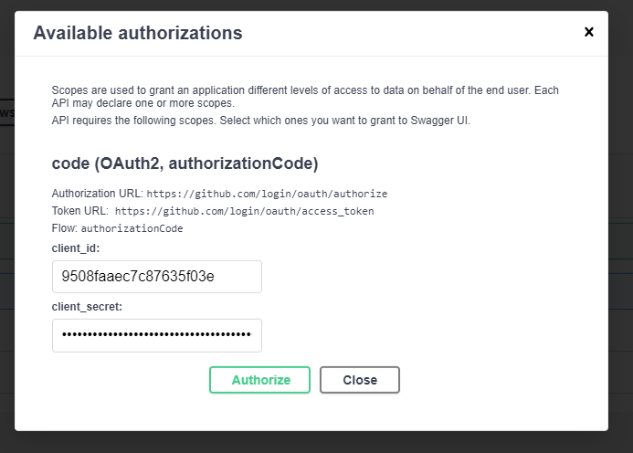
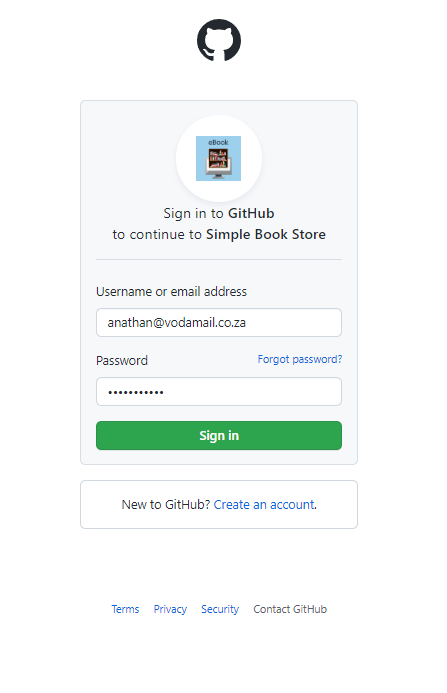
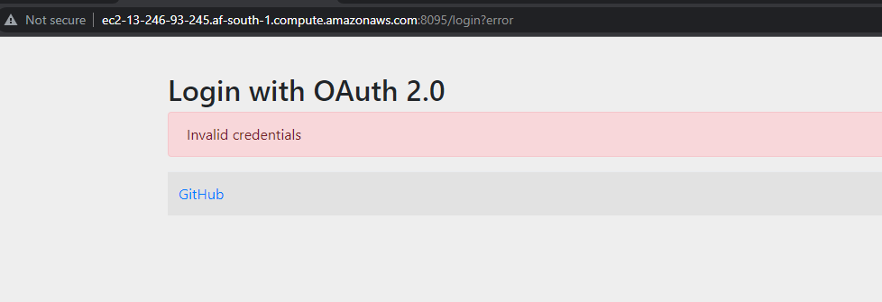
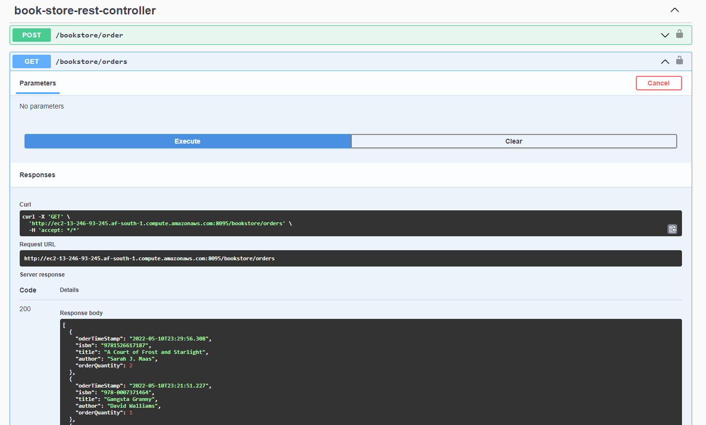

# Simple Book Store

## Links

- [Swagger UI](http://ec2-13-246-93-245.af-south-1.compute.amazonaws.com:8095/webjars/swagger-ui/index.html)
- [GitHub Repository](https://github.com/anthonynathan/simple-book-store.git)
- [CI Build](https://github.com/anthonynathan/simple-book-store/actions/workflows/gradle.yml)

***

## Using the API

### 1. Access the [Swagger UI](http://ec2-13-246-93-245.af-south-1.compute.amazonaws.com:8095/webjars/swagger-ui/index.html)

### 2. To authenticate click the Authorise button:

### 3. You are redirected to the GitHub login screen:

### 4. Now you seemingly get a login error:

### 5. Click GitHub and you’ll be redirected to the swagger UI and you’ll be authenticated:

